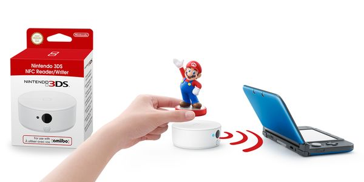

## Propositions de sujet
Voici un rapide aperçu, par ordre d'intérêt, des sujets que je souhaiterais traiter.

## Les chatbots

**Pourquoi en parler ?** Parce que c'est une technologie mêlants IA, algorithmes et linguistique, et en tant qu'ancienne étudiante linguiste le sujet m'intéresse énormément je suis curieuse de voir comment un ordinateur peut analyser des réponses fournies par un humain pour formuler ses propres questions/réponses.

Actuellement, on croise souvent des chatbots, que ce soit en ligne (ces horribles petites bulles de discussion qui s'ouvrent automatiquement quand on surfe sur des e-shop et réapparaissent continuellement... pire que des vendeurs en magasin, parfois).

Quelques liens pour avoir un rapide aperçu du sujet :
- [Wikipédia](https://fr.wikipedia.org/wiki/Chatbot)
- [Kabane ; les chatbots : de la création à l'application](https://www.kabane.ca/chatbots-de-creation-a-lapplication), qui offre un bon aperçu des différents chatbots qu'on croise régulièrement, les pour et les contre de l'utilsiation d'un bot, etc.

## Machine leraning, ou apprentissage automatique

**Pourquoi en parler ?** Cela rejoint un peu mon premier sujet, dans un spectre un peu plus large. Le _machine learning* c'esttout simplement la capacitée donnée à un ordinateur de pouvoir "apprendre" sur base des donénes qui lui sont fournies.

Quelques liens pour avoir un rapide aperçu du sujet :
- [Wikipédia](https://fr.wikipedia.org/wiki/Apprentissage_automatique)
- [Article Openclassroom](https://openclassrooms.com/fr/courses/4011851-initiez-vous-au-machine-learning/4011858-identifez-les-differentes-etapes-de-modelisation)

## Le NFC, ou Near Field Communication

**Pourquoi en parler ?** En heureuse propriétaire d'une Switch et d'une Nintendo 3DS, j'ai déjà eu l'occasion de rencontrer le NFC grâce aux Amiibo (cartes et figurines) que l'on peut scanner... directement en les approchant du pad de la manette. Sans m'être jamais penchée dessus, j'ai toujours été intriguée par le fonctionnement du NFC, qui est une technologie assez courante, bien qu'on ne s'en rende pas forcément compte... les cartes de banque sans contact en sont en bel exemple.

Quelques liens pour avoir un rapide aperçu du sujet :
- [Wikipédia](https://fr.wikipedia.org/wiki/Communication_en_champ_proche)
- [Article Echos du Net](https://www.echosdunet.net/dossiers/technologie-nfc)

